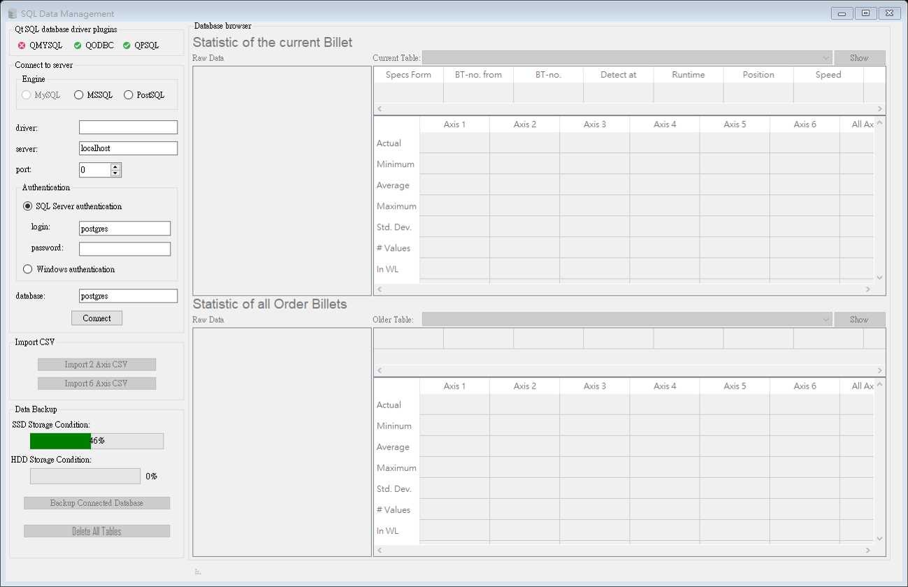

# Qt SQL Example
SQL accessing GUI, including the function of accessing the SQLDatabase, monitoring the current status of the drive and delete/backup of the connected database.

The application is developed with Qt 5.13.1 on Windows 10 and Ubuntu 16.04.
The program was tested on MySQL Server 5.5.57, Microsoft SQL Server 2008 R2 SP3 and PostgreSQL 11.

## SQL database drivers

A comprehensive discussion about SQL database drivers (Qt driver plugins as well as system drivers) can be found in [Qt Documentation](https://doc.qt.io/qt-5/sql-driver.html). MSSQL is handled by the ODBC driver.

Although binaries of the program have statically-linked libraries, in order to connect from Linux to MSSQL server, one should install ODBC SQL Server driver (e.g. `msodbcsql17`__*__).

The following section covers the essential tools to develop app with dynamically-linked SQL libraries.

### Windows 10

* Both Qt SQL driver plugins (QMYSQL and QODBC) should be already bundled with Qt SDK.
* MySQL driver can be *installed* by placing `libmysql.dll` from [C API for MySQL (mysqlclient)](https://dev.mysql.com/downloads/connector/c/) in the app working directory.
* ODBC Driver Manager and SQL Server driver are built in; hence, no further installation is necessary. Alternatively, instead of SQL Server driver, one can use Microsoft ODBC Driver; see [Microsoft Docs](https://docs.microsoft.com/en-us/sql/connect/odbc/windows/microsoft-odbc-driver-for-sql-server-on-windows).

### Ubuntu 16.04

Packages with Qt driver plugins and system SQL drivers:

* MySQL - `libqt5sql5-mysql` `libmysqlclient20`,
* ODBC ([unixODBC Driver Manager](http://www.unixodbc.org) and Microsoft ODBC Driver) - `libqt5sql5-odbc` `libodbc1` `unixodbc` `odbcinst` `msodbcsql17`__*__.

__*__ How to install `msodbcsql17` - [Installing the Microsoft ODBC Driver for SQL Server on Linux and macOS](https://docs.microsoft.com/en-us/sql/connect/odbc/linux-mac/installing-the-microsoft-odbc-driver-for-sql-server).
